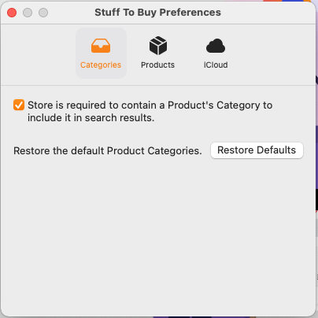

# MultiplatformTabBar

       

Creates a common **Tab Bar** control that runs and looks the same across multiple devices and OS (iOS, iPadOS, macOS & tvOS).

## Support

If you find `MultiplatformTabBar` useful and would like to help support its continued development and maintenance, please consider making a small donation, especially if you are using it in a commercial product:

<a href="https://www.buymeacoffee.com/KevinAtAppra" target="_blank"></a>

It's through the support of contributors like yourself, I can continue to build, release and maintain high-quality, well documented Swift Packages like `MultiplatformTabBar` for free.


<a name="Installation"></a>
## Installation

**Swift Package Manager** (Xcode 11 and above)

1. In Xcode, select the **File** > **Add Package Dependency…** menu item.
2. Paste `https://github.com/Appracatappra/MultiplatformTabBar.git` in the dialog box.
3. Follow the Xcode's instruction to complete the installation.

> Why not CocoaPods, or Carthage, or blank?

Supporting multiple dependency managers makes maintaining a library exponentially more complicated and time consuming.

Since, the **Swift Package Manager** is integrated with Xcode 11 (and greater), it's the easiest choice to support going further.

## Example
 
 The following example would generate a **Tab Bar** with three **Tabs** in SwiftUI:
 
 ```swift
 MultiplatformTabBar(tabPosition: .top, barHorizontalAlignment: .center)
 .tab(title: "Categories", icon: Image(systemName: "tray.fill")) {
     VStack {
        ...
     }
 }
 .tab(title: "Products", icon: Image(systemName: "shippingbox.fill")) {
     VStack {
        ...
     }
 }
 .tab(title: "iCloud", icon: Image(systemName: "icloud.fill")) {
     VStack {
        ...
     }
 }
 ```
 
 Would produce an **Tab bar** like the following:
 
 

# Documentation

The **Package** includes full **DocC Documentation** for all features.
